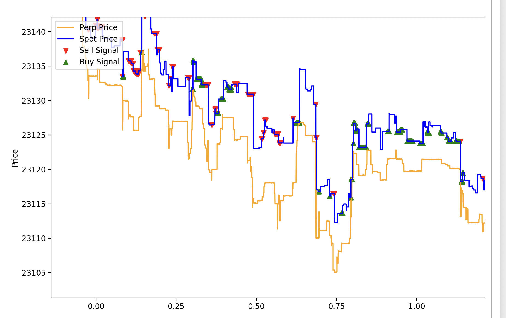

### Background: 
This is a homework assignment for a student-run class I took at Berkeley called Introduction to Quantitative Finance in Spring 2023. Student organization Traders@Berkeley runs the class, and all credit for the skeleton of the code goes to them. The assignment challenged us to design and implement a latency arbitrage strategy.

### The Problem: 
We were given two time-series datasets, one for the price of the perpetual Bitcoin (BTC) market, and one for the spot BTC market. These two assets are very closely correlated since they derive their value from the same thing. Additionally, the perpetual market typically leads the spot market, meaning an increase in price in the perpetual market will typically be followed by an increase in the spot market a handful of milliseconds later. Therefore, assuming we can access both streams of information and execute trades extremely fast, an arbitrage exists between buying the spot market after the perpetual spikes and selling the spot market after the perpetual dips. 

### The Simulation:
This codebase is of course only a backtest and doesn't connect to any real exchanges or do any real trading. Rather I must create an array of buy and sell orders across timestamps to tell the program when to buy and sell the asset. Because this is a High-Frequency Trading (HFT) strategy, each position will be automatically exited after a hold of 80-time ticks (the tick size varies a bit in the data but is about 5 milliseconds). The simulation is oversimplified because there are no trading costs, market impact, or delays when executing orders.

### My Algorithm: 
The arbitrage will make money in two ways. The first way is buying the spot BTC when the perpetual spikes, as the spot BTC will then spike as well. Likewise if we short the spot BTC when the perpetual crashes, then the spot will crash shortly thereafter. Therefore a successful algorithm simply needs to create accurate buy and sell signals by detecting significant spikes and dips in the price of the perpetual BTC market. Here's my successful strategy for accomplishing that:

1) Calculate the 'spread' between the spot BTC and perpetual BTC market at each timestep.
2) Calculate a moving_average of this spread at each timestep with some window size.
3) Calculate a moving_standard deviation at each timestep with some window size.
4) Calculate a buy and sell threshold, if the spread becomes abnormally large (spot significantly exceeds perpetual) that's a sell signal and a small or negative spread (perpetual exceeds spot) is a buy signal. For some real numbers k, l, sell_threshold = moving_average + (k * moving_standard_deviation) and buy_threshold = moving_average - (l * moving_standard_deviation)
   
### Results
In the backtest my algorithm executed a high proportion of profitable short-term trades earning a simulated profit of $63,922 during the simulated period of one day of trading in early 2023. 

